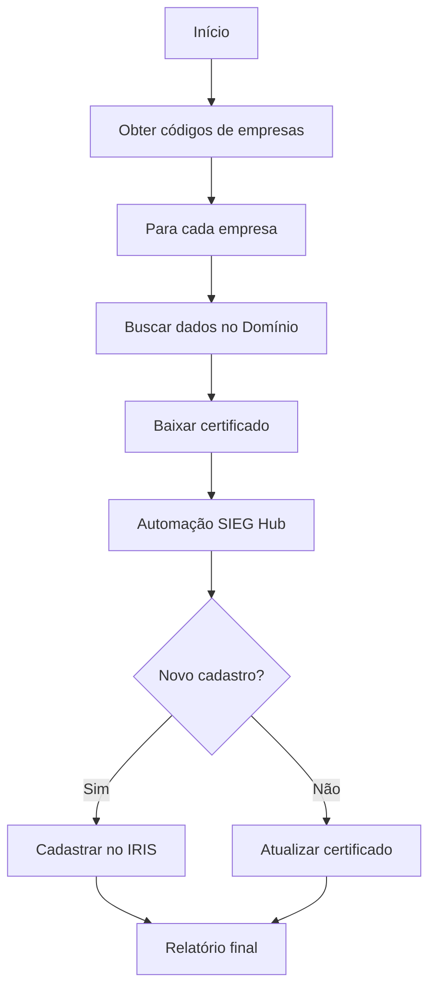
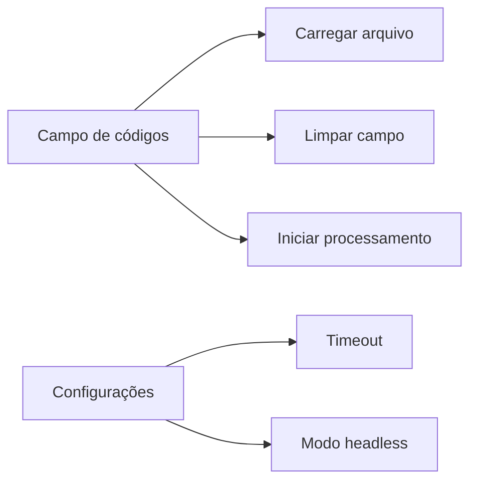

# Atualizador SIEG - Grupo Meta


*(Substitua por um logo real, se tiver)*

Aplicação desktop para atualização de certificados digitais de empresas no sistema SIEG Hub.

---

## 📜 Descrição

O Atualizador SIEG é uma aplicação desktop desenvolvida em Python que automatiza o processo de atualização de certificados digitais de empresas no sistema SIEG Hub. A ferramenta realiza:

1. Conexão com bancos de dados para obtenção de informações das empresas

2. Download e gerenciamento de certificados digitais

3. Automação web para cadastro/atualização no SIEG Hub

4. Integração com o módulo IRIS

5. Gerenciamento de erros e relatórios detalhados

---

## ✨ Funcionalidades Principais

* **Interface gráfica moderna** com CustomTkinter

* **Processamento em lote** de múltiplas empresas

* **Conexão com múltiplos bancos de dados**:

- Domínio (via pyodbc)

- Gestão de Certificados (MySQL)

* **Download seguro de certificados** com validação:

- Busca por CNPJ completo ou matriz

- Verificação de validade

- Armazenamento temporário seguro

* **Automação web completa**:

- Login automático no SIEG Hub

- Upload de certificados

- Preenchimento inteligente de formulários

- Atualização ou cadastro novo conforme necessário

* **Integração com módulo IRIS**

* **Sistema robusto de tratamento de erros**:

- Logs detalhados

- Screenshots de debug

- Relatório de empresas com problemas

* **Gerenciamento de progresso** com barra visual

* **Modo headless** para execução invisível

---

## 🚀 Tecnologias Utilizadas

* **Python 3.11+**

* **Bibliotecas Principais**:

- `customtkinter` - Interface gráfica moderna

- `selenium` - Automação web

- `mysql-connector-python` - Conexão com MySQL

- `pyodbc` - Conexão com SQL Server

- `Pillow` - Manipulação de imagens

- `python-dotenv` - Gerenciamento de variáveis de ambiente

* **Outras Dependências**:

- `CTkMessagebox` - Caixas de diálogo estilizadas

- `base64` - Codificação/decodificação de certificados

- `logging` - Sistema de logs profissional

- `threading` - Processamento assíncrono

---

## 📁 Estrutura do Projeto

```

atualizador-sieg/

├── assets/                   # Recursos visuais

│   └── frame0/               # Assets específicos da interface

│       ├── cert.ico          # Ícone da aplicação

│       ├── image_3.png       # Logo SIEG

│       └── image_4.png       # Logo Grupo Meta

├── chrome_standalone/        # Chrome e ChromeDriver empacotados

│   ├── chrome.exe

│   └── chromedriver.exe

├── debug_screenshots/        # Screenshots de erros (gerado em runtime)

├── certificados/             # Certificados temporários (gerado em runtime)

├── banco.py                  # Funções de acesso a bancos de dados

├── cadastro_IRIS.py          # Funções para cadastro no IRIS

├── main.py                   # Ponto de entrada principal

├── requirements.txt          # Dependências do projeto

├── .env                      # Configurações sensíveis (não versionado)

├── atualizador_sieg.log      # Log de execução (gerado em runtime)

└── certificados_problemas.txt # Relatório de problemas (gerado em runtime)

```

---

## 🏗️ Arquitetura e Design

### Padrões de Projeto

* **MVC (Model-View-Controller)**:

- Model (banco.py, cadastro_IRIS.py)

- View (customtkinter UI)

- Controller (main.py)

* **Singleton** para gerenciamento de conexões

* **Factory Method** para criação de drivers do navegador

### Princípios SOLID

* **Single Responsibility**: Cada módulo/classe tem uma responsabilidade única

* **Open/Closed**: Extensível para novos tipos de bancos de dados

* **Dependency Inversion**: Dependências abstraídas via interfaces

### Fluxo Principal



---

## ⚙️ Configuração e Execução

### Pré-requisitos

- Python 3.11+

- Chrome instalado (ou usar versão standalone incluída)

- Acesso aos bancos de dados:

- Domínio (SQL Server)

- Gestão de Certificados (MySQL)

### Passo a Passo

1. **Configurar variáveis de ambiente** (.env):

```ini

email=seu_email@sieg.com

senha=sua_senha_sieg

```

2. **Instalar dependências**:

```bash

pip install -r requirements.txt

```

3. **Executar aplicação**:

```bash

python main.py

```

4. **Interface de usuário**:



### Configurações Opcionais

- **Timeout**: Tempo de espera para elementos web (padrão: 30s)

- **Modo Headless**: Execução invisível do navegador (ativado por padrão)

---

## 🛠️ Funcionalidades Técnicas Detalhadas

### Conexão com Bancos de Dados

```python

# Domínio (SQL Server)

str_conexao_dominio = "suas_credenciais_para_conexao"

# Gestão de Certificados (MySQL)

config = {

'user': 'seu_usuario',

'password': 'sua_senha',

'host': 'seu_host',

'port': sua_porta,

'database': 'sua_base_de_dados'

}

```

### Download de Certificados

1. Busca por CNPJ completo

2. Fallback para matriz (primeiros 8 dígitos + '0001')

3. Validação de data de expiração

4. Decodificação base64 e salvamento seguro

### Automação Web

```python

def cadastrarIRIS(navegador, dadosEmpresa, caminho_PFX, senhaCertificado):

# Fluxo completo de cadastro

navegador.get('https://hub.sieg.com/IriS/#/Certificados')

# ... interações com a página ...

```

### Tratamento de Erros

- Exceções customizadas (`CertificadoNaoEncontradoError`)

- Múltiplas camadas de try/except

- Registro detalhado em log

- Screenshots automáticos em falhas

- Arquivos de relatório específicos

### Segurança

- Limpeza automática de certificados temporários

- Gerenciamento seguro de credenciais (.env)

- Validação de inputs do usuário

---

## 📊 Monitoramento e Logs

### Sistema de Logging

```python

def setup_logger(self):

self.logger = logging.getLogger(__name__)

self.logger.setLevel(logging.DEBUG)

# Configuração de handlers e formatters...

```

### Níveis de Log

- DEBUG: Detalhes técnicos para desenvolvimento

- INFO: Fluxo principal da aplicação

- WARNING: Problemas recuperáveis

- ERROR: Falhas operacionais

- CRITICAL: Erros graves que impedem funcionamento

### Relatórios Gerados

1. `atualizador_sieg.log` - Log completo da execução

2. `certificados_problemas.txt` - Empresas com certificados inválidos

3. `certificado_não_encontrado.txt` - Certificados não localizados

---

## 🚨 Tratamento de Erros Comuns

| Erro | Causa Provável | Solução |

|------|----------------|---------|

| `CertificadoNaoEncontradoError` | CNPJ não cadastrado | Verificar base de certificados |

| `pyodbc.InterfaceError` | Problema na conexão com Domínio | Validar DSN e credenciais |

| `selenium.TimeoutException` | Elemento web não encontrado | Aumentar timeout ou verificar seletor |

| `WebDriverException` | Problema no ChromeDriver | Verificar compatibilidade de versões |

| `FileNotFoundError` | Assets faltando | Verificar estrutura de diretórios |

---

## 🔮 Melhorias Futuras

1. **Interface para configuração de conexões**:

- Gerenciamento visual de strings de conexão

- Teste de conectividade integrado

2. **Suporte a outros bancos de dados**:

- PostgreSQL

- SQLite

3. **Sistema de templates**:

- Personalização de fluxos de trabalho

- Configurações salvas por perfil

4. **Monitoramento em tempo real**:

- Dashboard de execução

- Notificações por e-mail

5. **Automação expandida**:

- Suporte a outros módulos do SIEG

- Integração com sistemas contábeis

---

## 👥 Contribuição

1. Faça um fork do projeto

2. Crie uma branch para sua feature (`git checkout -b feature/nova-feature`)

3. Commit suas alterações (`git commit -am 'Adiciona nova feature'`)

4. Push para a branch (`git push origin feature/nova-feature`)

5. Abra um Pull Request

**Padrões de Código**:

- PEP 8

- Docstrings completas

- Type hints

---
